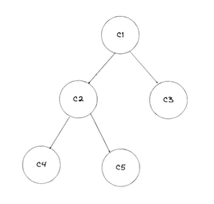

### Notes 

- useNavigate() hook allows you to programmatically navigate between routes in your React application. It's right way to switch pages in client side routing. 

- Always ensure that your component using useNavigate is rendered inside a valid <BrowserRouter>. 

- useNavigate hook is specifically designed to allow navigation to different routes managed by React Router. Without a router to manage these routes, useNavigate has no functional purpose.

- When using React.lazy, you must wrap the lazy-loaded components in a <Suspense> component to provide a fallback while the component is loading.

- The fallback prop of <Suspense> is used to define what content should be displayed while a lazily-loaded component (using React.lazy) is still being loaded. It acts as a placeholder until the component is ready to render.

- Prop drilling refers to the process of passing data (props) from a parent component to a deeply nested child component through intermediate components, even if those intermediate components don't need the data themselves.

- Context API: Share data directly between components without passing through intermediate layers. It basically <b>teleports</b> the props from parent to the child or to the layer that needs it. 

- Context API must be wrapped inside a Provider component because the Provider is responsible for supplying the context value to the component tree.

- State management in React is about controlling and sharing the data (state) that your app needs to work properly. It ensures that when the state changes, your app reacts and updates the UI automatically.

- Recoil is a state management library for React. It helps to share and manage data (state) across multiple components without having to pass props through every level (avoids "prop drilling").

- A selector is like a "calculator" for your state. It derives or computes new values from the atoms (state) or other selectors without modifying the original state. Think of it as a live, reusable formula for getting specific data.
    Example: 
    - You have a list of todos in an atom.
    - A selector can filter and give only the "completed todos"  without changing the main list.
